# Inward-Turn Meta-Loop

This note formalizes the recursive self-optimization diagram for the bounded autopoietic multimodal engine.

The core idea is preserved: the active engine serializes authorized state, derives a candidate representation or macro-operation, validates it in isolation, and either atomically commits the candidate or preserves the current engine.

The diagram intentionally distinguishes **requested compression** from **measured acceleration**. Active work cannot fall below the minimum executable unit, and speedup is limited by serial work, validation, memory traffic, dispatch overhead, hardware throughput, latency, energy and correctness constraints.

```mermaid
%%{init: {
  "theme": "base",
  "themeVariables": {
    "background": "#0a0a12",
    "primaryColor": "#1a2a4a",
    "secondaryColor": "#2a1a3a",
    "tertiaryColor": "#0a2a2a",
    "clusterBkg": "#0d0d20",
    "clusterBorder": "#ff00ff",
    "primaryTextColor": "#ffffff",
    "lineColor": "#ff00ff",
    "fontFamily": "monospace"
  },
  "flowchart": {
    "curve": "basis",
    "padding": 15,
    "nodeSpacing": 25,
    "rankSpacing": 35
  }
}}%%

flowchart TD
  subgraph Outer["🌀 Active Engine · bounded base instance"]
    O1["Instantiated voxels: 8³ = 512"]
    O2["Pipeline: compile → interpret → residual → decode"]
    O3["Measured baseline time: T₀"]
    O4["Immutable verifier and commit root"]
  end

  subgraph Inward["🌀 Inward-Turn Transactional Meta-Loop"]
    direction TB
    I1["1 · Serialize authorized state<br/>code, lattice, weights, ROM, traces and metrics"]
    I2["2 · Encode candidate representation<br/>latent form, macro-op or revised policy"]
    I3["3 · Fork isolated candidate pages<br/>active pages remain read-only"]
    I4["4 · Compile and execute in sandbox"]
    I5["5 · Verify<br/>bounds · deterministic replay · tests · hash · resource limits"]
    I6{"6 · verified ∧ better ∧ safe ∧ authorized?"}
    I7["7 · Atomic root/pointer swap<br/>publish candidate and seal journal"]
    I8["7b · Roll back<br/>discard candidate and preserve active root"]
    I9["8 · Measure actual work, latency, memory and loss"]
    I10["9 · Repeat with accepted state<br/>n ← n + 1"]

    I1 --> I2 --> I3 --> I4 --> I5 --> I6
    I6 -->|"✅ commit bit = 1"| I7
    I6 -->|"❌ commit bit = 0"| I8
    I7 --> I9
    I8 --> I9
    I9 --> I10 -->|"next authorized turn"| I1
  end

  subgraph Accelerated["🚀 Accepted Engine After n Commits"]
    A1["Effective work:<br/>Wₙ = max(Wmin, ceil(W₀ / Πᵢrᵢ))"]
    A2["Opcode surface:<br/>1 byte identifies ≤ 256 opcodes;<br/>ROM indirection may reference larger macro definitions"]
    A3["Measured speedup:<br/>Sₙ = T₀ / Tₙ"]
    A4["Amdahl-style bound:<br/>Sₙ ≤ 1 / ((1-p) + p/Rₙ + Oₙ)"]
    A5["For W₀ = 512 and requested r = 1000:<br/>the literal work-unit floor is reached after one accepted turn"]
  end

  Outer -->|"self-serialize authorized state"| Inward
  Inward -->|"accepted candidate"| Accelerated
  Accelerated -->|"becomes next active root"| Outer

  EQ["📐 Transactional Dr Moagi form<br/>Cₙ = ΠΛ[Ξₙ + P(Ξₙ) - Eₙ + Ωₙ]<br/>gₙ = verified ∧ better ∧ safe ∧ authorized<br/>Ξₙ₊₁ = MUX(gₙ, Cₙ, Ξₙ)"]
  EQ -.-> Inward

  style Outer fill:#0a1a2a,stroke:#00ff00
  style Inward fill:#1a0a2a,stroke:#ff00ff
  style Accelerated fill:#0a2a0a,stroke:#00ffff
```



## Why the original exponential statement was adjusted

The expression

```text
active cells = 512 / 1000ⁿ
```

cannot remain a literal cell count once it falls below one. With `512` initial cells and a requested reduction factor of `1000`, the minimum integer work unit is reached after the first accepted reduction:

```text
ceil(512 / 1000) = 1
```

Further recursive turns may still improve instruction fusion, cache behavior, dispatch, representation quality or hardware utilization, but they cannot repeatedly divide the same integer active-cell count by `1000`.

Likewise,

```text
speed = S₀ × 1000ⁿ
```

is a target model rather than a guaranteed physical result. The implementation must measure:

```text
Sₙ = T₀ / Tₙ
```

and account for the serial fraction, verification cost, memory movement, interpreter or dispatch overhead, finite bandwidth and the minimum amount of irreducible work.

## One-bit commit form

Let `candidate_root` be the verified candidate manifest and `active_root` the current immutable manifest. The final selection is:

```text
mask = -commit_bit
next_root = (mask & candidate_root) | (~mask & active_root)
```

The recursive loop therefore changes the active engine only when the complete verification gate resolves to one. A failed candidate does not partially modify the active state.
